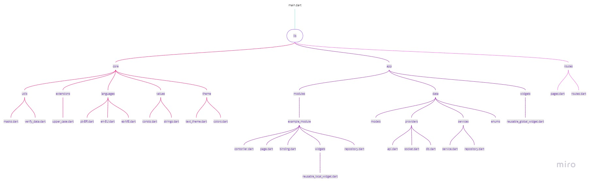
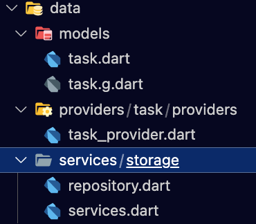
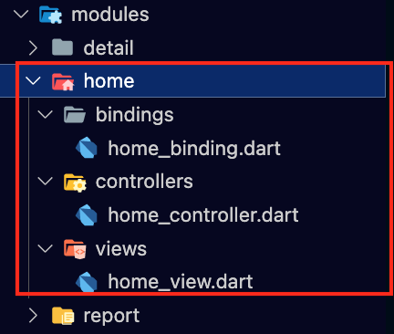
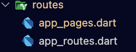
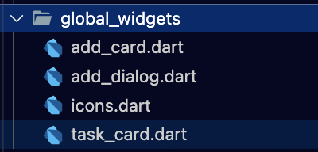

<h1>📝 GetX Todo APP</h1>

Ceci est une application mobile de gestion de tâches, développée avec Flutter et le framework GetX.

<h2>📌 Description</h2>
Le but de ce projet est de démontrer l'utilisation du pattern GetX pour la structure du code source de l'application, afin qu'il soit facilement gérable, que les fichiers ne soient pas lourds ou longs et que l'ensemble communique sans trop de mal.<br>
<br>
<h2>🚀 Fonctionnalités de l'application</h2>

<li>Ajout et modification de tâches 📝</li><li>Marquer les choses à faire comme terminées ✅</li><li>Supprimer les choses à faire en faisant un slide vers la gauche 🗑️</li><li>Ajouter et supprimer des types de tâches 📌</li><li>Affichage de la liste des tâches 📋</li><li>Affichage de la liste d'un rapport sur les tâches 📊</li>

<br>

<h2>🎨 Organisation du code</h2>
Dans ce projet, nous avons utilisé le pattern GetX pour la structure de code. Le pattern GetX est une alternative au pattern MVC (Model-View-Controller) pour la gestion d'états dans les applications Flutter. <br> Il est basé sur le modèle MVVM (Model-View-ViewModel) mais utilise des contrôleurs (Controllers) pour gérer l'état de l'application.
Dans ce pattern, chaque page (View) de l'application a un contrôleur (Controller) qui gère l'état de la page. Le contrôleur est responsable de la logique métier, de la récupération des données et de la mise à jour de l'état de la page. Les pages sont donc passives et ne contiennent pas de logique métier.
<br><br>
Le pattern GetX est facile à utiliser, car il ne nécessite pas beaucoup de code boilerplate :clipboard:, et il est également très performant, car il utilise des observables pour la mise à jour de l'interface utilisateur, et une bonne gestion des états de l'application.
<p>De manière globale , la structure est la suivante :</p>

<p>Appliquée à ce projet, nous obtenons ce qui suit :</p>
<h3>📁 app</h3>
Le répertoire qui contenir tous les dossiers de notre application.<br>
<h3>📁 data</h3>
Dossier responsable de contenir tout ce qui est relatif aux données.

En l'occurrence, il s'agit des <strong>modèles</strong> :pencil2: (Le modèle de nos tâches) , des <strong>providers</strong> :card_file_box: ( qui se charge de fournir le service de stockage. Il peut aussi s'agir d'une API ) des <strong>services</strong> :hammer: (Le service de stockage de nos tâches en mémoire).<br>
<h3>📁 modules</h3>
Chaque module se compose d'une page, de son GetXController respectif et de ses dépendances ou liaisons(Bindings).
<em><strong>Le dossier Binding contient ici les classes pour l'injection de dépendances</strong></em>
<p>Exemple : Le module home</p>
<br>
<h3>📁 routes</h3>
Dans ce dossier nous déposons nos routes vers nos différentes pages.<br>

<p>Dans le fichier app_routes.dart, nous définissons des constantes pour les routes</p>

```
part of 'app_pages.dart';
// DO NOT EDIT. This is code generated via package:get_cli/get_cli.dart

abstract class Routes {
  Routes._();
  static const HOME = _Paths.HOME;
  static const DETAIL = _Paths.DETAIL;
  static const REPORT = _Paths.REPORT;
}

abstract class _Paths {
  _Paths._();
  static const HOME = '/home';
  static const DETAIL = '/detail';
  static const REPORT = '/report';
}
```
<p>Tandis que dans le fichier app_pages.dart, nous définissons les routes vers les pages/vues</p>

```
part 'app_routes.dart';

class AppPages {
  AppPages._();

  static const INITIAL = Routes.HOME;

  static final routes = [
    GetPage(
      name: _Paths.HOME,
      page: () => const HomeView(),
      binding: HomeBinding(),
    ),
    GetPage(
      name: _Paths.DETAIL,
      page: () => DetailView(),
      binding:
```
<h3>🧩 global_widgets</h3>
Ce dossier contient des widgets qui peuvent être réutilisés dans de multiples <em><strong>modules</strong></em><br>
📁 
<br>
<h3>💻 core</h3>
Ce dossier contient basiquement le cœur de l'application. C'est l'endroit où l'on définira les méthodes globalement utiles au projet, les thèmes, les classes d'Exception pour gérer les erreurs...
En l'occurrence :
🛠️ utils
Le dossier <strong>utils</strong> contient les extensions utiles dans tout le projet et les clés permettant de stocker nos tâches en mémoire locale.
<p>Extrait du fichier <code>extensions.dart</code> : Cette extension s'applique sur tous les <code>double</code> et permet de créer des dimensions responsives.</p>

```
extension PercentSized on double {
  double get hp => (Get.height * (this / 100));
  double get wp => (Get.width * (this / 100));
}
```
<br>
<h3>🔢 values</h3>
Le dossier <strong>values</strong> contient des valeurs constantes réutilisables dans toute l'application.<br>
<h2>🤝 Contribution</h2>
Les contributions sont les bienvenues! Si vous souhaitez contribuer à ce projet, veuillez suivre les étapes suivantes:
<li>Fork du projet</li><li>Créez une branche pour votre fonctionnalité: <code>git checkout -b feature/nouvelle-fonctionnalité</code></li><li>Effectuez vos modifications et effectuez un commit: <code>git commit -am "Ajout de la nouvelle fonctionnalité"</code></li><li>Poussez les modifications vers votre branche: <code>git push origin feature/nouvelle-fonctionnalité</code></li><li>Créez une demande de tirage (pull request)</li> <br>
<h2>🙏 Crédits</h2>
Ce projet a été développé par Marcel pour démontrer l'utilisation du pattern GetX dans le développement d'applications mobiles avec Flutter.
<li>Fullstack School : Dont j'ai suivi le tuto youtube afin de développer cette application.</li><li>kauemurakami : Qui propose le pattern GetX. Plus de détails sur ce pattern à l'adresse : <a href= 'https://github.com/kauemurakami/getx_pattern'>GetX Pattern</a> </li><br>
<h2>🔖 Licence</h2>
Ce projet est sous licence MIT. Veuillez consulter le fichier <code>LICENSE</code> pour plus d'informations.